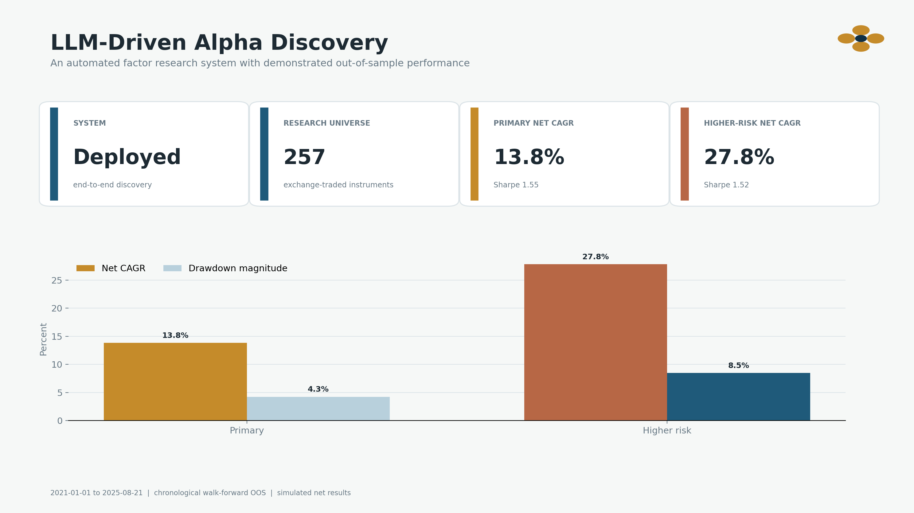
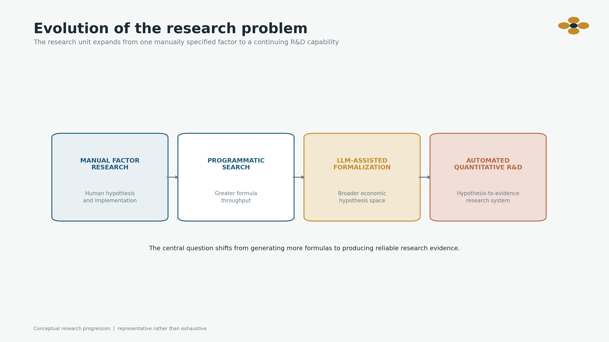
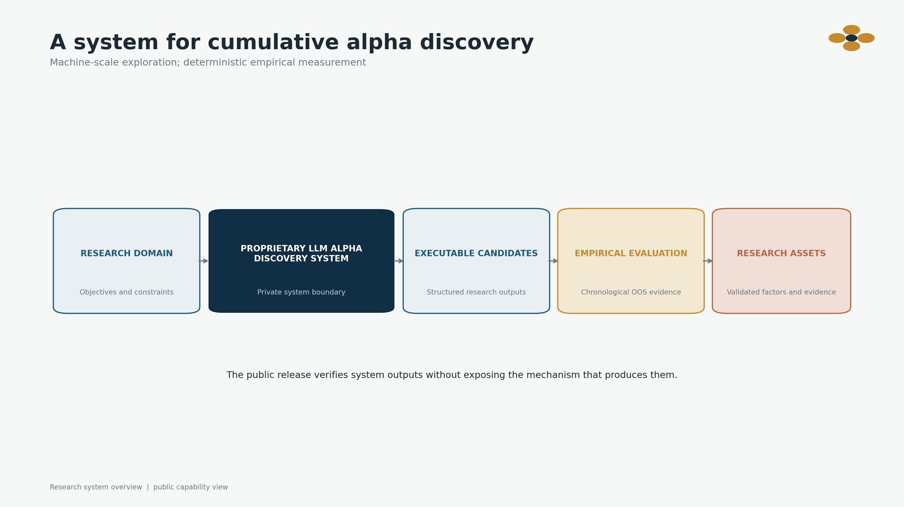
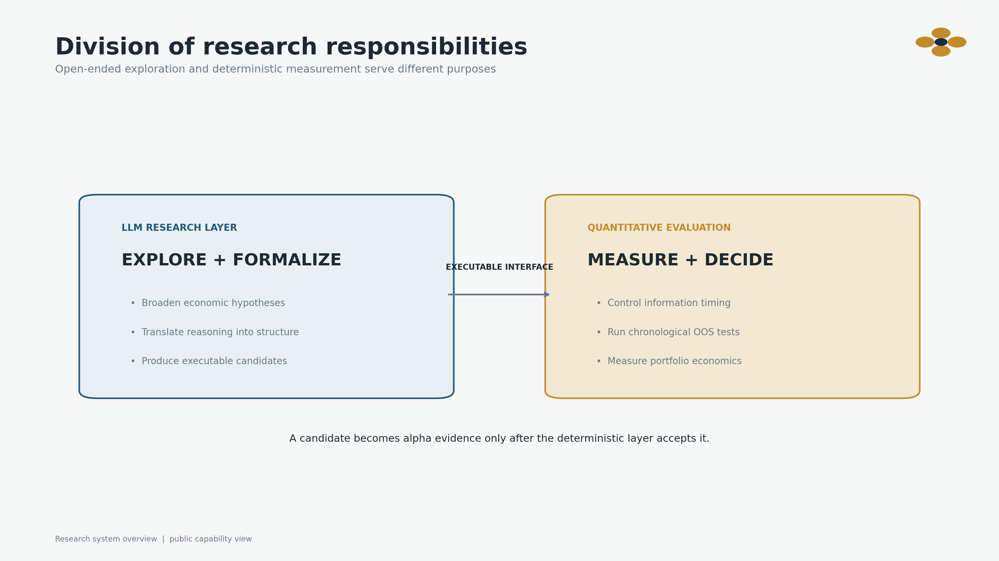
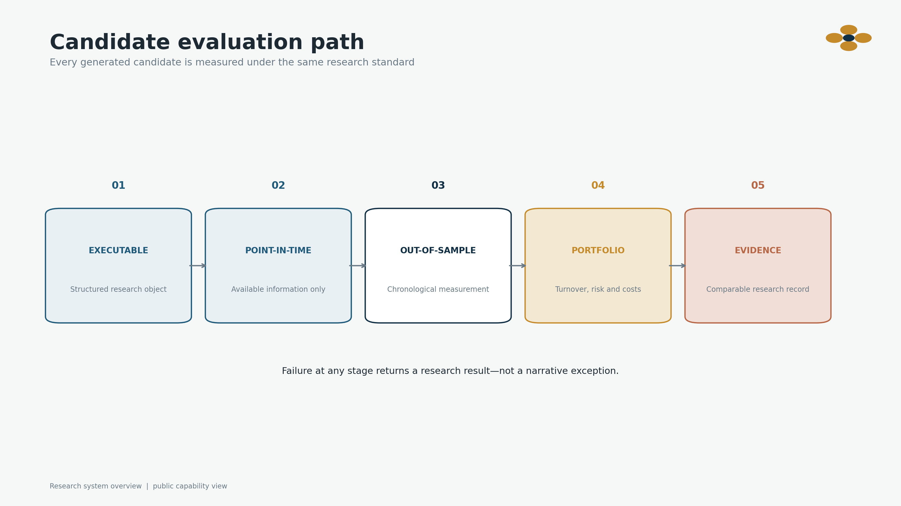
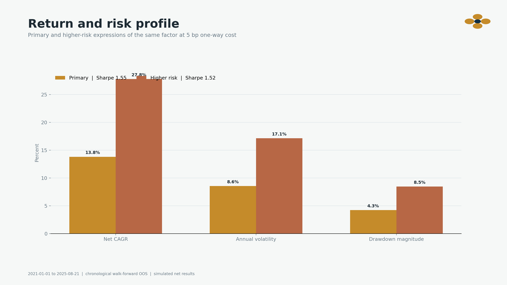
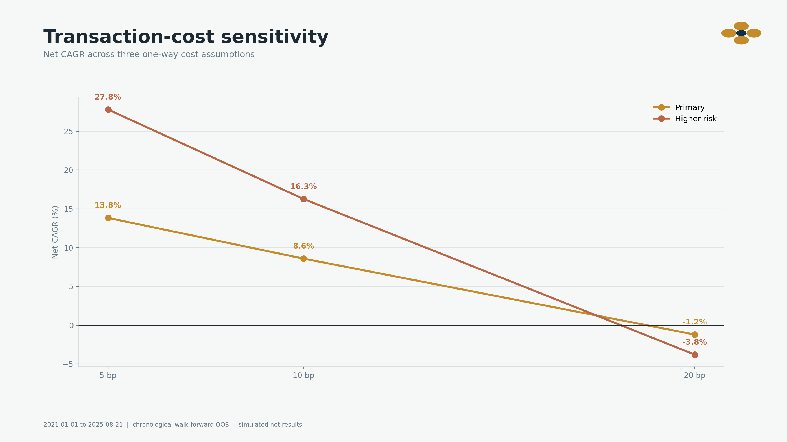
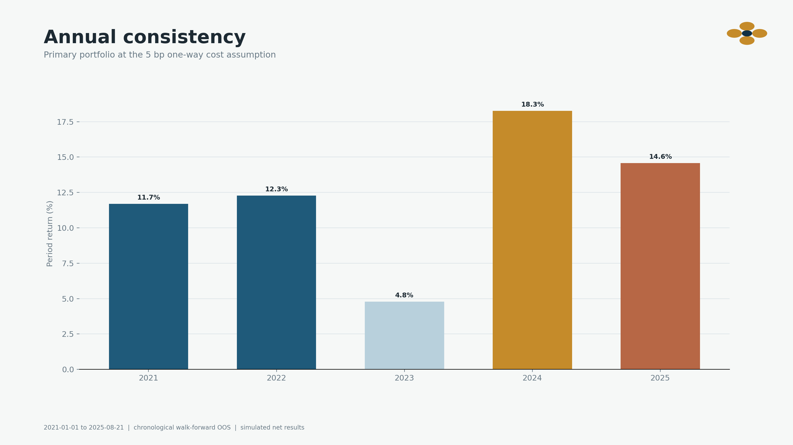
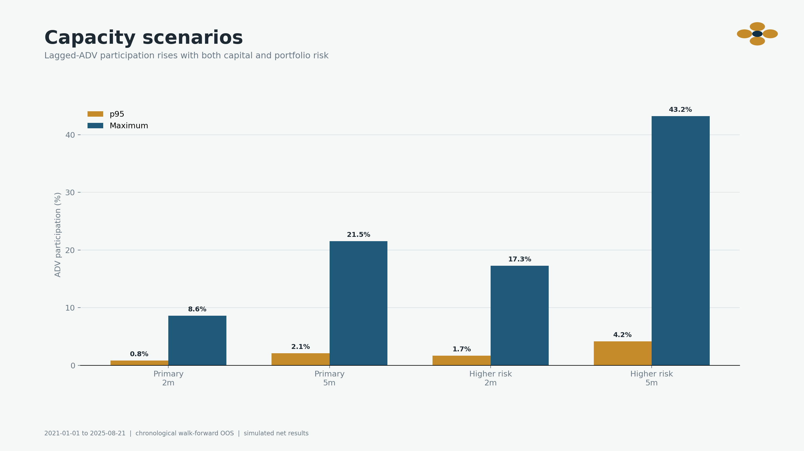

# LLM-Driven Full-Stack Alpha Mining

> A fully automated, closed-loop system for discovering, implementing, and validating executable alpha factors.



This project turns an LLM from a factor-idea generator into an operational quantitative research system. The language model expands and formalizes economic hypotheses; deterministic code controls whether any candidate is accepted as alpha. Generation increases research breadth, while measurement remains governed by conventional quantitative discipline.

Here, **full-stack** means that one research loop connects hypothesis generation, factor implementation, point-in-time data handling (using only information available at each simulated decision time), portfolio construction, trading-cost analysis, and evidence management. **Closed-loop** means that every hypothesis is generated, formalized, executed, evaluated, ranked, and retained or rejected under the same rules.

The system was deployed on a 257-instrument exchange-traded universe. One discovered factor produced **13.83% net CAGR**, **1.55 Sharpe**, and **−4.25% maximum drawdown** in walk-forward out-of-sample evaluation from 2021-01-01 through 2025-08-21, after a modeled one-way trading cost of 5 bp. A higher-risk portfolio expression produced **27.80% net CAGR**, **1.52 Sharpe**, and **−8.47% maximum drawdown** under the same cost assumption.

## Why this system exists

Factor research is limited not only by computation, but by the number of economic ideas a researcher can formulate precisely, implement correctly, and evaluate consistently. Each candidate must cross several different forms of work: economic reasoning, formal specification, data alignment, statistical testing, portfolio construction, and implementation analysis. The process is expensive even when the final answer is rejection.

LLM-based quantitative research has begun moving from [human–AI factor formulation](https://arxiv.org/abs/2308.00016) toward [automated data-centric R&D](https://arxiv.org/abs/2310.11249) and [full-stack quantitative research agents](https://arxiv.org/abs/2505.15155). In this project, those terms are made concrete: open-ended reasoning is connected to an empirical process that is executable, chronologically valid, and economically measurable. The important shift is no longer whether a language model can write a plausible formula, but whether it can participate in a repeatable research system whose measurements—not its prose—decide the outcome.



That is the problem addressed here. Instead of treating every factor as a separate research project, the system establishes a repeatable path from a broad research objective to an executable factor candidate and, ultimately, a retained evidence record. The durable output is not a single formula; it is a reusable discovery-and-evaluation engine with a traceable record for every experiment.



## From Economic Hypotheses to Executable Factors

A financially coherent hypothesis is not yet an executable alpha factor. A candidate can look statistically interesting and still fail once information timing, turnover, portfolio construction, trading costs, drawdown, or liquidity are included. Conversely, increasing leverage can magnify an exposure but cannot repair a weak underlying return source.

The system therefore separates two responsibilities:

- **The LLM explores and formalizes.** It converts a research domain into structured, executable factor candidates instead of unstructured investment commentary.
- **The quantitative layer measures and decides.** It applies deterministic data, timing, statistical, portfolio, cost, and risk logic. The LLM never determines that its own output works.



This separation is the key control. It keeps the generative component open enough to broaden the hypothesis space while preventing persuasive language from becoming empirical evidence.

## One Research Path for Every Candidate

Every generated candidate follows the same closed-loop path: **generate → formalize → execute → evaluate → rank → retain or reject**. It must be executable, use only information available at the simulated decision time, pass chronological out-of-sample measurement, survive portfolio construction and explicit frictions, and produce an evidence record that can be compared with other experiments.



These rules remain stable even when the internal discovery method evolves. The same measurement standard is applied to favorable and unfavorable candidates, and a failed experiment cannot be rescued through narrative reinterpretation. This is how the system connects the flexibility of an LLM to the auditability expected in quantitative research.

## A real empirical deployment

To test whether this automation produced more than plausible research language, the system was run end-to-end on an exchange-traded cross section of 257 instruments. A discovered factor was carried from machine-generated research output through point-in-time data preparation, chronological evaluation, portfolio construction, and cost analysis.

| Evidence | Published result |
|---|---:|
| Out-of-sample period | 2021-01-01 to 2025-08-21 |
| Portfolio observations | 1,123 |
| Research universe | 257 instruments |
| Qualified cross-sectional observations | 1,799 |
| HAC t-statistic | 5.27 |
| Positive calendar buckets | 5 / 5 |

The reported statistics describe walk-forward out-of-sample performance. Cross-sectional inference uses heteroskedasticity-and-autocorrelation-consistent statistics, while portfolio evidence is evaluated after modeled trading costs.

## Portfolio Risk Scaling

The same discovered factor is shown at two portfolio risk levels. The higher-risk expression approximately doubles both return and volatility while preserving a similar Sharpe ratio; it is not presented as a separately discovered strategy.



| Portfolio expression | One-way cost | Net CAGR | Sharpe | Max drawdown | Calmar |
|---|---:|---:|---:|---:|---:|
| Primary | 5 bp | **13.83%** | **1.55** | **−4.25%** | **3.25** |
| Primary | 10 bp | 8.58% | 1.00 | −5.67% | 1.51 |
| Primary | 20 bp | −1.21% | −0.10 | −19.08% | −0.06 |
| Higher risk | 5 bp | **27.80%** | **1.52** | **−8.47%** | **3.28** |
| Higher risk | 10 bp | 16.27% | 0.96 | −11.31% | 1.44 |
| Higher risk | 20 bp | −3.79% | −0.14 | −36.97% | −0.10 |

## Cost Sensitivity and Implementation Economics



Performance remains positive when the primary cost assumption is doubled from 5 to 10 bp, but both portfolio expressions lose money under the 20 bp stress. The factor therefore retains a positive net return under its intended implementation setting, while execution quality remains part of the alpha rather than an afterthought.

The cost curve is also a useful research result. It identifies the region in which the statistical signal continues to support a viable portfolio and the point at which trading friction overwhelms the return source.

## What the result reveals across time



The primary 5 bp expression was positive in all five reported calendar buckets. The weakest period returned 4.78% and the strongest 18.27%. The magnitude is not constant, which is expected for a market signal, but the positive sign across the reported periods provides evidence beyond the full-sample Sharpe ratio alone.

This does not require the factor to be equally strong in every regime. It asks a more realistic question: whether the measured return source persists through materially different market environments without one isolated period accounting for the entire result.

## Capacity and Scaling



Typical participation remains moderate at the smaller capital scenario, while maximum participation rises much faster when both portfolio risk and capital increase. Tail liquidity—the stressed, high-participation cases—rather than average liquidity is therefore the relevant scaling constraint.

| Portfolio expression | Capital scenario | p95 ADV participation | Maximum ADV participation |
|---|---:|---:|---:|
| Primary | 2m | 0.83% | 8.61% |
| Primary | 5m | 2.08% | 21.54% |
| Higher risk | 2m | 1.67% | 17.29% |
| Higher risk | 5m | 4.17% | 43.22% |

The capacity figures are scenario diagnostics rather than a claim of executable size. Their purpose is to show how the strategy’s implementation boundary changes as capital and risk are scaled.

## From One Validated Factor to a Reusable Discovery Engine

This deployment produced one validated factor, but the factor is not the limit of the project. The reusable asset is the standardized workflow around it: a way to expand research breadth, apply one empirical standard, preserve successful and unsuccessful experiments, and continue building a traceable factor inventory.

That distinction matters because automated discovery should not be judged by the most persuasive generated idea. It should be judged by the quality of the executable factor candidates it produces, the discipline of the experiments that reject them, and the portfolio evidence retained by the candidates that survive.

The discovery engine itself is not distributed. This repository exposes the system-level reasoning and aggregate evidence needed to evaluate the work without distributing the methods required to reconstruct the factor. The public code validates the **evidence contract** (the required fields and checks for every reported result) and the **artifact manifest** (the versioned list of files used to produce it); it does not generate the reported factor.

## Repository map

```text
README.md                          Research story, system thesis, and evidence
RESEARCH_NOTE.md                   Concise research narrative
EVIDENCE_AND_LIMITATIONS.md        Metric definitions and interpretation bounds
docs/SYSTEM_OVERVIEW.md            Public capability map
docs/data-sources-and-licensing.md Data and redistribution boundary
evidence/                          Versioned aggregate evidence and checksums
schemas/                           Machine-readable evidence contracts
src/alpha_evidence/                Evidence and manifest validators
scripts/                           Deterministic figure and manifest builders
tests/                             Contract, consistency, and integrity tests
```

## Verify the public evidence

```bash
python -m pip install -e '.[dev]'
pytest
alpha-evidence evidence evidence/aggregate-evidence.v3.json
alpha-evidence manifest evidence/release-manifest.v1.json \
  --allowlist evidence/release-allowlist.txt
```

Historical simulation only; not investment advice or a guarantee of future results.
